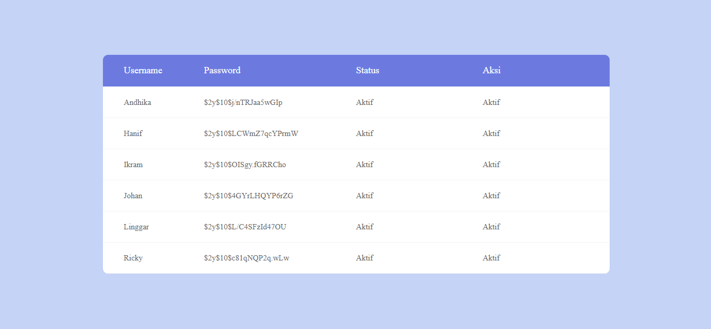

# Sa MWA Undip (Diponegoro University) Internship Technical Interview
This is the technical interview submission code for SA-MWA Undip internship (2017). The prompt is to make a CRUD website with **SPA feature (Single Page Application)** using **AJAX** &amp; **jQuery**

# Description
The code is the submission code for technical interview in order to get internship in SA-MWA Undip. The code is actually not fully finished. There are some prompts that hasn't been done due to limited time given. The progress of the project can be seen in `Project Checklist` section.

# Prompt
The prompt can be seen in [SOAL UJIAN PROGRAMMER MAGANG.pdf](/SOAL%20UJIAN%20PROGRAMMER%20MAGANG.pdf)

# Screenshots
* Form Pendaftaran

* Table


# Technology Used
* HTML
* CSS
* Javascript
* AJAX
* jQuery
* MySQL
* phpMyAdmin

# Installation
* Set up your Apache Webserver & phpMyAdmin
* Upload sql database file in `database\magang_samwa.sql` into phpMyAdmin
* Copy all files in 'htdocs' folder into your main website files configuration
* Run your webserver
* Open the website

# Project Checklist
- [x] Create a from with these input: **username**, **password**, and **status** ("aktif" & "tidak aktif")
- [x] 2 Button: **New** (reset the form), and **Save** (save to database)
- [x] Alert to notify the user what is happening in the application (warning, success, or error)
	- [x] Notify when form are not completely filled
	- [x] Notify when data has saved to the database
	- [x] Notify when data failed to be saved to the database
- [x] Table with complete attribute as a column for each data
- [x] Encrypt the password
- [x] Implementing SPA concept (interaction with backend using jQuery AJAX)
  - [x] Send the request without reloading
  - [x] Update the table after adding data
- [ ] Feature: Edit & delete data
- [ ] User login features
- [ ] Add family member features

# API Specification
## Add User
Request :
* Method : POST
* Endpoint : /api/add_user.php
* Header :
  * Content-Type: application/json
  * Accept: application/json
* Body :
```
{
    "username" : "string, unique",
    "password" : "string",
    "status" : "string"
}
```

Response :
```
{
    "success" : "string",
    "message" : "string"
}
```

## Get All Users
Request :
* Method : GET
* Endpoint : /api/get_all_users.php
* Header :
  * Accept: application/json
Response :
```
{
  {
      "username" : "string, unique",
      "password" : "string",
      "status" : "string"
  }
  {
      "username" : "string, unique",
      "password" : "string",
      "status" : "string"
  }
  .
  .
  .
}
```

# Credits
- Login_v10 by Colorlib
- Table_Responsive_v2 by CodeSandbox
